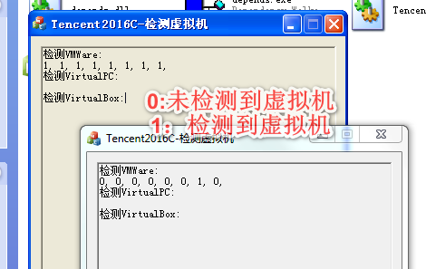

#### 截图



#### 虚拟机检测原理（部分）

资料来自互联网，参考资料： [Tencent2016C (虚拟机检测技术)](https://www.52pojie.cn/thread-701845-1-1.html)


##### 1、执行特权指令检测

在x86体系中，一些指令在获取硬件相关信息时不产生异常，如sidt、sgdt、sldt、cpuid等，而VMware因为性能原因并没有虚拟这些指令，所以意味着这些指令在vm虚拟机中和物理机中运行时会返回不同的结果。

可能会因为虚拟机的升级，导致结果不一样。

##### 2、LDT（局部描述符表）

sgdt与sldt指令探测技术，依赖于LDT（局部描述符表）由处理器分配而非操作系统分配的事实。因为Windows正常情况下不使用LDT，但VM提供了LDT的虚拟化支持，结果就是：真机中LDT位置为0，而在虚拟机，不为0。同时对于GTR，虚拟机中应为0xFFXXXXXX , 否则为真机。

```c++
inline bool IsVirtualPC_LDTCheck()
{
	unsigned short ldt_addr = 0;
	unsigned char ldtr[2];

	_asm sldt ldtr
	ldt_addr = *((unsigned short *)&ldtr);
	return ldt_addr != 0x00000000;
}
```

##### 3、注册表检测

```c++
inline bool DetectVM()
{
	HKEY hKey;

	char szBuffer[64];

	unsigned long hSize = sizeof(szBuffer)-1;

	if (RegOpenKeyEx(HKEY_LOCAL_MACHINE, "HARDWARE\\DESCRIPTION\\System\\BIOS\\", 0, KEY_READ, &hKey) == ERROR_SUCCESS)
	{

		RegQueryValueEx(hKey, "SystemManufacturer", NULL, NULL, (unsigned char *)szBuffer, &hSize);

		if (strstr(szBuffer, "VMWARE"))
		{
			RegCloseKey(hKey);
			return true;
		}

		RegCloseKey(hKey);
	}

	return false;
}
```

##### 4、GDT检测
```c++
inline bool IsVirtualPC_GDTCheck()
{
	unsigned int gdt_addr = 0;
	unsigned char gdtr[6];

	_asm sgdt gdtr
	gdt_addr = *((unsigned int *)&gdtr[2]);
	return (gdt_addr >> 24) == 0xff;
}
```

##### 5、TSS检测

```c++
inline bool IsVirtualPC_TSSCheck()
{
	unsigned char mem[4] = { 0 };

	__asm str mem;
	return (mem[0] == 0x00) && (mem[1] == 0x40);
}

```

##### 6、I/O通信端口检测

原理：使用IN指令来读取特定端口的数据进行两机通讯，但由于IN指令属于特权指令，在处于保护模式下的真机上执行此指令时，除非权限允许，否则将会触发类型为"EXCEPTION_PRIV_INSTRUCTION"的异常，而在虚拟机中并不会发生异常，在指定功能号为0xA/10（获取VMware版本）时，会在EBX中返回其版本号“VMXH”；而当功能号为0x14时，可用于获取VMware内存大小，当大于0时则说明处于虚拟机中。代码分析如下：

```c++
//查询I/O通信端口
BOOL CheckVMWare1()
{
        BOOL bResult = TRUE;
        __try
        {
                __asm
                {
                        push   edx
                        push   ecx
                        push   ebx                //保存环境
                        mov    eax, 'VMXh'
                        mov    ebx, 0             //将ebx清零
                        mov    ecx, 10            //指定功能号，用于获取VMWare版本，为0x14时获取VM内存大小
                        mov    edx, 'VX'          //端口号
                        in     eax, dx            //从端口edx 读取VMware到eax
                        cmp    ebx, 'VMXh'        //判断ebx中是否包含VMware版本’VMXh’，若是则在虚拟机中
                        setz[bResult]             //为零 (ZF=1) 时设置字节
                        pop    ebx                //恢复环境
                        pop    ecx
                        pop    edx
                }
        }
        __except (EXCEPTION_EXECUTE_HANDLER)       //如果未处于VMware中，则触发此异常
        {
                bResult = FALSE;
        }
        return bResult;
}
```

##### 调试器检测

[AntiDebuggers](https://github.com/wanttobeno/AntiDebuggers)


